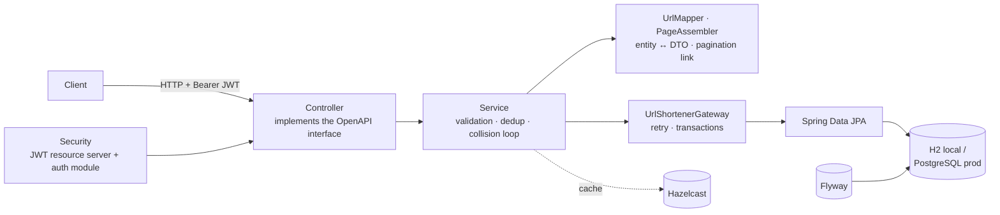
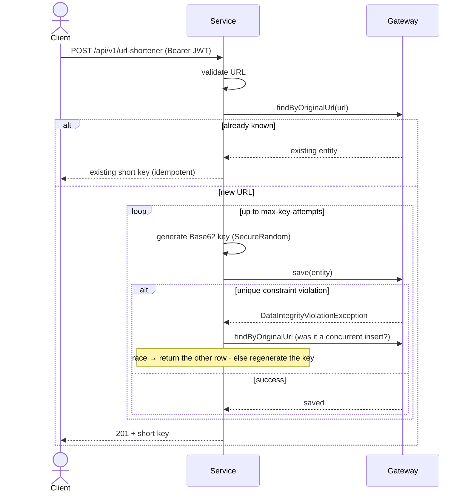
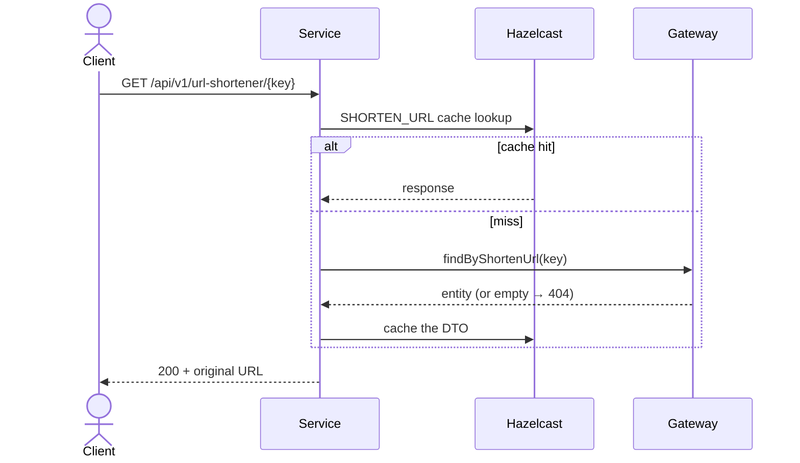

# Spring Boot URL Shortener

A production-oriented Spring Boot REST API that converts long URLs into short keys. It is
contract-first (OpenAPI), secured with JWT, schema-migrated with Flyway, and runs on an H2 file
database locally or PostgreSQL in production.

# Features
- **Pluggable key generation**: the short key is produced behind a `ShortKeyGenerator` strategy. The default implementation uses a cryptographically strong `SecureRandom` over a Base62 alphabet, so keys are unpredictable (no enumeration) and uniformly distributed.
- **Configurable length**: the key length is configurable (`app.shortener.key-length`, default 7) within the 10-character column limit, keeping URLs short and predictable in structure.
- **Collision handling**: short keys are protected by a database unique constraint; on a collision the service regenerates a new key (bounded by `app.shortener.max-key-attempts`).
- **Idempotent & race-safe creation**: resubmitting a known URL returns its existing short key; concurrent inserts of the same URL are reconciled via a unique constraint on the original URL.

# Non-Functional Requirements
* Scalability
* Performance and Elasticity
* Availability
* Resilience

# General Design

## Component / Application design

Layered and contract-first. Each layer has a single responsibility, which keeps the business
logic free of transport, persistence and presentation concerns.



- **Controller** — implements the interface generated from `oas3.yaml`; HTTP, bean validation, security.
- **Service** — the only place with business rules (URL validation, deduplication, bounded key regeneration).
- **Mapper / PageAssembler** — MapStruct mapping and pagination-response assembly (owns the `next` link and the deploy URL, so the service never sees a web concern).
- **Gateway** — wraps the repository with the retry policy (`@DatabaseRetryable`) and transaction boundaries.
- **Cross-cutting** — JWT security, Hazelcast cache, Flyway migrations.

## Request flows

Creating a short URL (deduplication + collision-safe insert):



Resolving a short URL (cache-first on the hot path):



## Key generation & trade-offs

The short key is produced behind a `ShortKeyGenerator` strategy; the default is a **Base62**
string drawn from a **`SecureRandom`**.

- **Unpredictable** — a cryptographic RNG means keys can't be enumerated to discover other users' URLs (the original timestamp-based generator was guessable).
- **Length vs collisions** — length is configurable (default **7** → 62⁷ ≈ 3.5 × 10¹² keys). Longer keys shrink collision probability at the cost of slightly longer URLs; the value is externalised so it can grow with volume.
- **Uniqueness is enforced by the database**, not by the generator: a `UNIQUE` constraint on `shorten_url` is the source of truth. On a violation the service simply regenerates (bounded by `max-key-attempts`) — cheap and correct even under concurrency.
- **Why not a counter/hash?** A sequential counter is enumerable and leaks volume; a hash of the URL removes the ability to have distinct keys per policy. The strategy interface keeps those options open (e.g. a Snowflake/Base62 counter) without touching callers.

## Concurrency, resilience & caching

- **Idempotency & races** — `UNIQUE(original_url)` turns a concurrent check-then-insert into a caught `DataIntegrityViolationException`; the service re-reads and returns the row the other request created. Reads run in `@Transactional(readOnly = true)`.
- **Retry** — the gateway retries transient database failures (`@DatabaseRetryable`) but never integrity violations (those are handled explicitly).
- **Caching** — the hot **resolve** path caches the response DTO in Hazelcast (`SHORTEN_URL`). The dedup lookup goes straight to the indexed `original_url` column, so it doesn't need a cache.

## Security & token model

Stateless **OAuth2 resource server** (HS256 JWT): reads are public, writes require a Bearer token.
A self-contained auth module issues the tokens (register / login / refresh / logout) — no external
IdP required.

- **Short access token + revocable refresh token** — limits the exposure window of a stolen token; the refresh token (rotated on use) is exchanged at `/auth/refresh`.
- **Revocation** — because a pure JWT is irrevocable, a small amount of state lives in Hazelcast: logout bumps a per-user *tokens-valid-after* watermark (rejecting all outstanding access tokens) and drops the active refresh token. This stays on the **cold path** (login/refresh/logout) so access-token validation remains stateless. A `type` claim stops a refresh token from being used as an access token.

## Persistence & migrations

Flyway owns the schema (`db/migration`); Hibernate runs in `validate` mode and never alters it.
The DDL is written to be portable across **H2** (local) and **PostgreSQL** (prod), which the
Testcontainers integration test verifies on a real PostgreSQL.

## Scalability

- **Stateless application** → scale horizontally behind a load balancer; no session affinity.
- **Distributed cache** — Hazelcast is shared across instances, so the resolve path stays fast cluster-wide.
- **Database** — the resolve-heavy read path suits read replicas; the short key is a natural shard key if the table is partitioned.
- **Key space** — 62ⁿ grows exponentially with length; increase `key-length` as volume rises to keep the collision rate negligible.

## Technologies used
Here are the technologies used for this Api :
* Java 17 · Maven
* Spring Boot 3.3.3 — Web, Data JPA, Actuator, Validation, Cache, Retry
* Spring Security — OAuth2 Resource Server (JWT, HS256)
* Flyway (schema migrations) · H2 (local) / PostgreSQL (prod)
* Hazelcast (distributed cache + token-revocation state)
* OpenAPI / springdoc (contract-first spec + Swagger UI)
* MapStruct (entity ↔ DTO mapping)
* Apache commons-validator (URL validation)
* Docker & docker-compose · GitHub Actions (CI)
* JUnit 5 · Mockito · Testcontainers · JaCoCo (coverage)
* Postman / Newman (end-to-end API smoke test)

## How to run application
To build and run the project :
* git clone https://github.com/patken/spring-boot-url-shortener-api.git
* cd spring-boot-url-shortener-api
* mvn clean install
  * It will build up the project by generating Api specification and model needed
  * Api specification oas3.yaml is located : src/main/resources/openapi/oas3.yaml
* Run with : mvn spring-boot:run --spring.profiles.active=local
  * Here we used local configuration for setting h2 database ; in others environment, it will be another database like Postgres
  * The database schema is managed by **Flyway** (`src/main/resources/db/migration`); Hibernate runs in `validate` mode and never alters the schema.
  * First run after upgrading from a pre-Flyway version: delete the stale local database (`rm ~/data/database.mv.db`) so Flyway can create a clean schema.
* The Rest Api will be available at the url : http://localhost:8080/api/v1/url-shortener

## Run with Docker (app + PostgreSQL)

A multi-stage [`Dockerfile`](Dockerfile) builds a slim, non-root image and
[`docker-compose.yml`](docker-compose.yml) runs the API against a real PostgreSQL — the same
database used in production, with Flyway applying the schema on startup:

```bash
docker compose up --build
# API on http://localhost:8080, PostgreSQL on 5432
docker compose down -v   # stop and wipe the database volume
```

## Continuous integration

[GitHub Actions](.github/workflows/ci.yml) runs `mvn verify` on every push/PR (unit tests, the
Testcontainers PostgreSQL integration test — which runs on the CI Docker daemon — and the JaCoCo
coverage gate) and builds the Docker image.

## Authentication

Reads (GET) are public; creating a short URL (POST) requires a `Bearer` JWT (HS256). The API
ships with a self-contained auth module — no external identity provider needed:

* `POST /api/v1/auth/register` — subscribe with `{ "username", "password" }` (password stored BCrypt-hashed). Returns `201`.
* `POST /api/v1/auth/login` — returns `{ "accessToken", "refreshToken", "tokenType": "Bearer", "expiresIn" }`.
* `POST /api/v1/auth/refresh` — exchange a valid `{ "refreshToken" }` for a new access token (the refresh token is rotated).
* `POST /api/v1/auth/logout` — (authenticated) revokes the user's tokens.

**Token model & revocation.** Access tokens are short-lived (15 min) so a stolen token's exposure
window is small; a longer-lived, revocable **refresh token** is exchanged at `/auth/refresh`.
Because a pure JWT is otherwise irrevocable, revocation state is kept server-side in Hazelcast:
`logout` bumps a per-user *tokens-valid-after* watermark (rejecting every outstanding access token)
and invalidates the refresh token. A custom `OAuth2TokenValidator` enforces the watermark, and a
`type` claim prevents a refresh token from being used as an access token. This keeps the hot path
stateless (revocation is only touched at login/refresh/logout).

Health/info actuator endpoints stay public. Example end-to-end flow:

```bash
# 1. Subscribe
curl -X POST localhost:8080/api/v1/auth/register \
  -H 'Content-Type: application/json' -d '{"username":"alice","password":"password123"}'

# 2. Login and capture the token
TOKEN=$(curl -s -X POST localhost:8080/api/v1/auth/login \
  -H 'Content-Type: application/json' -d '{"username":"alice","password":"password123"}' \
  | sed -n 's/.*"accessToken":"\([^"]*\)".*/\1/p')

# 3. Create a short url with the token
curl -X POST localhost:8080/api/v1/url-shortener \
  -H "Authorization: Bearer $TOKEN" \
  -H 'Content-Type: application/json' -d '{"url":"https://www.example.com/some/long/path"}'
```

## Smoke-testing the API

A ready-to-run **Postman / Newman** collection exercises the whole flow end to end
(register → login → create → resolve → list). It is idempotent — re-running it when the user
already exists still passes. See [`postman/README.md`](postman/README.md).

Prerequisites: the API running (`mvn spring-boot:run -Dspring-boot.run.profiles=local`) and,
for the CLI, **Node.js 18+** (provides `npx`):

```bash
npx --yes newman run postman/url-shortener.postman_collection.json \
  -e postman/local.postman_environment.json
```

Or run the collection directly from the Postman app (no Node needed).

## Api Specification (EndPoint)

When the application is running, an interactive **Swagger UI** is served at
<http://localhost:8080/swagger-ui.html>. It renders the hand-written, contract-first
definition ([`oas3.yaml`](src/main/resources/openapi/oas3.yaml)), also reachable directly at
`/openapi/oas3.yaml`.

[OAS3 Specification file](https://petstore.swagger.io/?url=https://raw.githubusercontent.com/patken/spring-boot-url-shortener-api/main/src/main/resources/openapi/oas3.yaml)

### POST Save a new url with its shortened version.

POST /url-shortener

> Body Parameters

```json
{
  "url": "string"
}
```

#### Params

|Name|Location|Type|Required|Title|Description|
|---|---|---|---|---|---|
|body|body|[ShortenUrlRequest](#schemashortenurlrequest)| no | ShortenUrlRequest|none|

> Response Examples

> 201 Response

```json
{
  "originalUrl": "string",
  "shortenUrl": "string"
}
```

#### Responses

|HTTP Status Code |Meaning|Description|Data schema|
|---|---|---|---|
|201|[Created](https://tools.ietf.org/html/rfc7231#section-6.3.2)|Url created successfully.|[ShortenUrlResponse](#schemashortenurlresponse)|
|400|[Bad Request](https://tools.ietf.org/html/rfc7231#section-6.5.1)|Bad Request due to missing / invalid parameters|[Problem](#schemaproblem)|
|401|[Unauthorized](https://tools.ietf.org/html/rfc7235#section-3.1)|Unauthorized|[Problem](#schemaproblem)|
|500|[Internal Server Error](https://tools.ietf.org/html/rfc7231#section-6.6.1)|Internal Server Error|[Problem](#schemaproblem)|

### GET Get All url shortened url

GET /url-shortener

#### Params

|Name|Location|Type|Required|Title|Description|
|---|---|---|---|---|---|
|page|query|Integer| no ||The page of the occurrence|
|limit|query|Integer| no ||The limit for the number of records to be return by page|

> Response Examples

> 200 Response

```json
{
  "records": [
    {
      "originalUrl": "string",
      "shortenUrl": "string"
    }
  ],
  "total": 25,
  "next": "http://localhost:8080/api/v1/url-shortener?page=1&limit=10"
}
```

#### Responses

|HTTP Status Code |Meaning|Description|Data schema|
|---|---|---|---|
|200|[OK](https://tools.ietf.org/html/rfc7231#section-6.3.1)|Ok, All the url are retrieved successfully.|[ShortenUrlPageResponse](#schemashortenurlpageresponse)|
|400|[Bad Request](https://tools.ietf.org/html/rfc7231#section-6.5.1)|Bad Request due to missing / invalid parameters|[Problem](#schemaproblem)|
|401|[Unauthorized](https://tools.ietf.org/html/rfc7235#section-3.1)|Unauthorized|[Problem](#schemaproblem)|
|404|[Not Found](https://tools.ietf.org/html/rfc7231#section-6.5.4)|Not Found|[Problem](#schemaproblem)|
|500|[Internal Server Error](https://tools.ietf.org/html/rfc7231#section-6.6.1)|Internal Server Error|[Problem](#schemaproblem)|


### GET Get original url from shortened url

GET /url-shortener/{shortenUrl}

#### Params

|Name|Location|Type|Required|Title|Description|
|---|---|---|---|---|---|
|shortenUrl|path|string| yes ||The shortened url used to get original url|

> Response Examples

> 200 Response

```json
{
  "originalUrl": "string",
  "shortenUrl": "string"
}
```

#### Responses

|HTTP Status Code |Meaning|Description|Data schema|
|---|---|---|---|
|200|[OK](https://tools.ietf.org/html/rfc7231#section-6.3.1)|Ok, the original url is retrieved successfully.|[ShortenUrlResponse](#schemashortenurlresponse)|
|401|[Unauthorized](https://tools.ietf.org/html/rfc7235#section-3.1)|Unauthorized|[Problem](#schemaproblem)|
|404|[Not Found](https://tools.ietf.org/html/rfc7231#section-6.5.4)|Not Found|[Problem](#schemaproblem)|
|500|[Internal Server Error](https://tools.ietf.org/html/rfc7231#section-6.6.1)|Internal Server Error|[Problem](#schemaproblem)|

### Data Schema

<h4 id="tocS_Element">Element</h2>

<a id="schemaelement"></a>
<a id="schema_Element"></a>
<a id="tocSelement"></a>
<a id="tocselement"></a>

```json
{
  "message": "string",
  "timestamp": "2024-08-20T15:35:12"
}

```

Element

#### Attribute

|Name|Type|Required|Restrictions|Title|Description|
|---|---|---|---|---|---|
|message|string|false|none||A short, human-readable summary of the reason|
|timestamp|string(date-time)|false|none||A timestamp identifying the specific occurrence of the element in cause|

<h2 id="tocS_ShortenUrlPageResponse">ShortenUrlPageResponse</h2>

<a id="schemashortenurlpageresponse"></a>
<a id="schema_ShortenUrlPageResponse"></a>
<a id="tocSshortenurlpageresponse"></a>
<a id="tocsshortenurlpageresponse"></a>

```json
{
  "records": [
    {
      "originalUrl": "string",
      "shortenUrl": "string"
    }
  ],
  "total": 25,
  "next": "http://localhost:8080/api/v1/url-shortener?page=1&limit=10"
}

```

ShortenUrlPageResponse

#### Attribute

|Name|Type|Required|Restrictions|Title|Description|
|---|---|---|---|---|---|
|records|[[ShortenUrlResponse](#schemashortenurlresponse)]|true|none||[Response while getting original url]|
|total|long|false|none||Total number of records found|
|next|string|false|none||Simple Link to get the next x elements|

<h2 id="tocS_ShortenUrlResponse">ShortenUrlResponse</h2>

<a id="schemashortenurlresponse"></a>
<a id="schema_ShortenUrlResponse"></a>
<a id="tocSshortenurlresponse"></a>
<a id="tocsshortenurlresponse"></a>

```json
{
  "originalUrl": "string",
  "shortenUrl": "string"
}

```

ShortenUrlResponse

#### Attribute

|Name|Type|Required|Restrictions|Title|Description|
|---|---|---|---|---|---|
|originalUrl|string|false|none||Original Url shortened|
|shortenUrl|string|false|none||Url shortened|

<h2 id="tocS_Problem">Problem</h2>

<a id="schemaproblem"></a>
<a id="schema_Problem"></a>
<a id="tocSproblem"></a>
<a id="tocsproblem"></a>

```json
{
  "title": "string",
  "detail": "string",
  "elements": [
    {
      "message": "string",
      "timestamp": "2024-08-20T15:35:12"
    }
  ]
}

```

Problem

#### Attribute

|Name|Type|Required|Restrictions|Title|Description|
|---|---|---|---|---|---|
|title|string|false|none||A short, human-readable summary of the problem type|
|detail|string|false|none||Explanation specific to this occurrence of the problem|
|elements|[[Element](#schemaelement)]|false|none||Error List|

<h2 id="tocS_ShortenUrlRequest">ShortenUrlRequest</h2>

<a id="schemashortenurlrequest"></a>
<a id="schema_ShortenUrlRequest"></a>
<a id="tocSshortenurlrequest"></a>
<a id="tocsshortenurlrequest"></a>

```json
{
  "url": "string"
}

```

ShortenUrlRequest

#### Attribute

|Name|Type|Required|Restrictions|Title|Description|
|---|---|---|---|---|---|
|url|string|true|none||Original Url to shorten|
